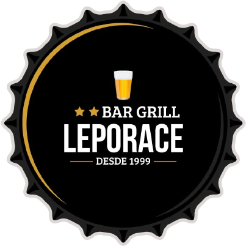

<p align="center">
  <a href="https://leporace-bar-grill.vercel.app/" target="_blank" rel="noopener noreferrer">
  </a>
</p>
<h3 align="center">Leporace Bar & Grill</h3>

---

<p align="center"> Restaurant unofficial presentation site: Leporace Bar & Grill, made with ReactJS in Typescript
    <br> 
</p>

## 📝 Table of Contents

- [Dependencies / Limitations](#limitations)
- [Future Scope](#future_scope)
- [Setting up a local environment](#getting_started)
- [Usage](#usage)
- [Technology Stack](#tech_stack)
- [Contributing](../CONTRIBUTING.md)
- [Authors](#authors)
- [Acknowledgments](#acknowledgments)

## ⛓️ Dependencies / Limitations <a name = "limitations"></a>

- Google Maps API Key

## 🚀 Future Scope <a name = "future_scope"></a>

- Add another animations
- Do a server-side database to save the reservations
- Evolve flow between sections

## 🏁 Getting Started <a name = "getting_started"></a>

These instructions will get you a copy of the project up and running on your local machine for development
and testing purposes.

### Prerequisites

Install Typescript
```
npm install typescript --save-dev
```

To install all the dependencies required for this project, you will have to install it via npm with:
```
npm i
```

### Installing

After all the dependencies installed, you'll have only to run locally with:

```
npm start
```

## ⛏️ Built With <a name = "tech_stack"></a>

- [Typescript](https://www.typescriptlang.org/) - Template
- [ReactJS](https://reactjs.org/) - Web Framework

## ✍️ Authors <a name = "authors"></a>

- [@sorrab-prog](https://github.com/sorrab-prog) - Idea & Development

## 🎉 Acknowledgments <a name = "acknowledgments"></a>

- Typescript
